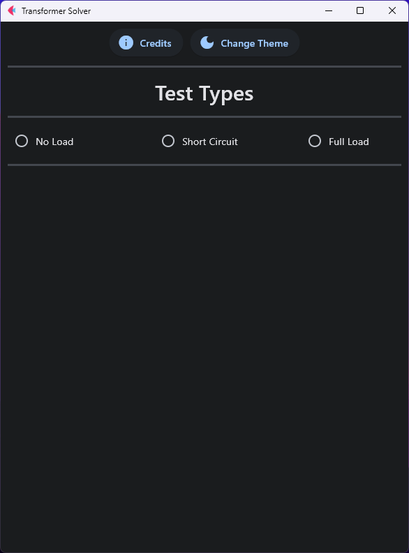
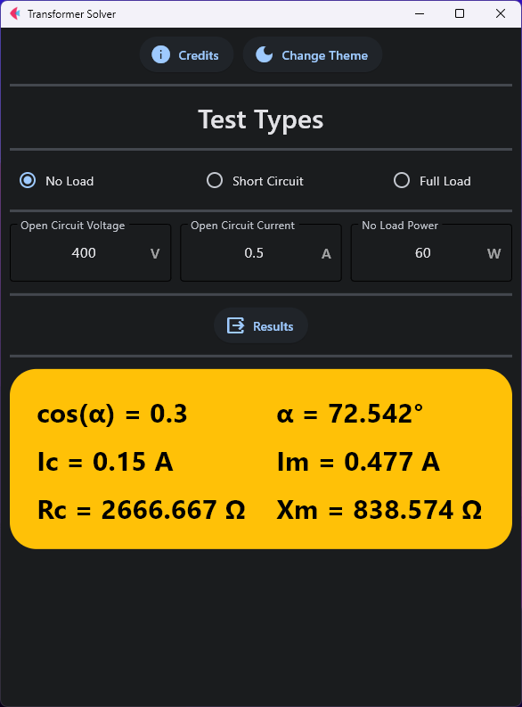
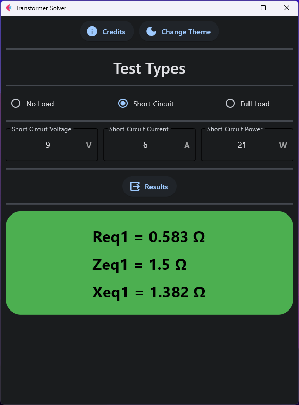
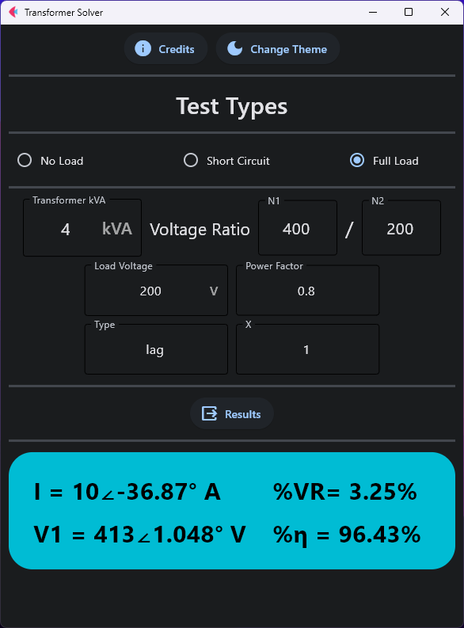

# Circuits-Transformers-Solver
## This transformer solver helps you to easily and  quickly solve the primary and secondary full-load currents of the transformer.
# Features :
- Switch between light and dark theme 
 
- Solve no load test
 
- Solve short circuit test 

- Solve full load test
 

 # Download : 
  	[##Download](https://upfiles.com/EVL7)